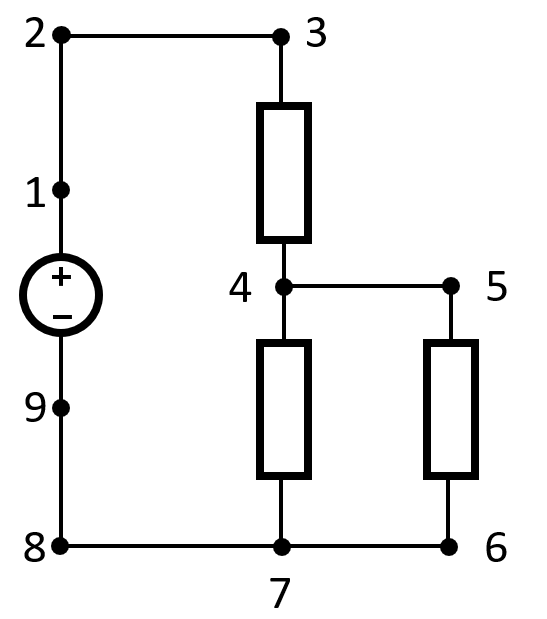

# Tabel of Content
1. [Setup lokal git copy](#setup-lokal-git-copy)
2. [Structure](#structure)
3. [Set up local Python interpreter](#set-up-local-python-interpreter)
   1. [install modified lcapy and schemdraw](#install-modified-lcapy-and-schemdraw)
   2. [Required Packages](#required-packages)
4. [Build Packages](#build-packages)
5. [Host inskale locally](#host-inskale-locally)
6. [Write netlits](#Write netlits)
   1. [Draw hints](#draw-hints)
   2. [Supported components](#supported-components)
   3. [Component W](#component-w)
   4. [Components R, L, C, Z](#componets-r-l-c-z)
   5. [Sources](#sources)
   6. [Finding the start and end nodes](#finding-the-start-and-end-nodes)
# Setup lokal git copy
```
git clone --recursive https://gitlab.hs-pforzheim.de/stefan.kray/inskale.git
```
the `--recursive` keyword is important, to clone the submodule lcapy-inskale
# Structure
There are three folders inside the InskaLE Project.
- lcapy-inskale: is a submodule that includes a fork of the lcapy GitHub repository to merge changes and updates easily.
The submodule has to branches, the master which is the same as the fork from original repository and the lcapy-inskale
branch which hold the modifications for this project. 
- Pyodide: includes all files that are needed to host pyodide and execute the lcapy package in a browser to simplify
circuits
- Schemdraw: a slightly modified version of the Schemdraw package

# Set up local Python interpreter
## install modified lcapy and schemdraw
```
cd .\path\to\inskale-git-repo\Inskale
pip install -e .\lcapy-inskale
pip uninstall schemdraw
pip install -e .\schemdraw
```
the `-e` keyword is only necessary if you want to automatically apply changes to the packages without
reinstalling them or modify them yourself

## Required packages
The lcapy package needs:
- matplotlib
- numpy
- sympy>=1.10.1
- networkx
- IPython
- setuptools
- wheel
- property_cached
- (schemdraw) don't download package from pypi
- ordered_set

for testing:
- pytest
- flake8
- flake8-bugbear
- flake8-comprehensions
- flake8-requirements

for releasing:
- wheel
- twine

The schemdraw package needs:
- matplotlib>=3.4
- ziafont>=0.8
- ziamath>=0.10
- latex2mathml

Some IDEs read the `setup.py` and `setup.cfg` and offer to auto install needed packages.
The necessary packages should be installed from the step before, so don't install them by hand.

# Build packages
in each package folder is a `buildPackage.ps1`. Those files build the package and in case
of the lcapy-inskale package it also tests it before it gets build. The new build package is modved
to Pyodide/Packages and the Pyodide/solve.py is updated automatically and annotated with the current
Package version

# Host inskale locally
To host inskale locally you only have to go to the Pyodide Folder and execute `StartServer.ps1`
this executes a simple http server integrated with Python. It executes it from a script called
`GzipSimplePythonHttpServer.py` to support Gzip compression for .whl-Files. Inskale is then hosted on 
`http:\\localhost:8000`. It is important to go to `http:\\` and not `https:\\` because the simple http server does
not support the https protocol. For an integration into an IDE it the `StartServerProcess.ps1` and 
`StopServerProcess.ps1` may be helpful. `StartServerProcess.ps1` starts a process and retrieves the process id and saves
it into `server.pid`, which `StopServerProcess.ps1` uses to stop the process if the process is still running. 
`StartServerProcess.ps1` calls `StopServerProcess.ps1` when `server.pid` is in the directory. Some IDEs can be
configured to execute a skript before executing code so the Server can be started before the IDE accesses
`http:\\localhost:8000` to debug and test inskale.

# Write netlists

## Draw hints
possible draw hints are `right, left, up, down`

## Supported components
Supported components are: `W, R, L, C, Z, V` for Wire, Resistor, Inductor, Capacitor, Impedance, Voltage source

## Component W
A netlist line with the component `W` contains:
```
W<identifier> <start node> <end node>; <drawing hint>
```
the identifier is optional so it could  be:
```
W1 1 2; left
W 1 2; left
```
All components have the length 1 you need as many wires as components to span the same length this is due to 
implementation

## Components R, L, C, Z
A netlist line with `R, L, C or Z` always contains:
```
<component typy><identifier> <start node> <end node> {<value>}; <drawing hint>
```
e.g.
```
R1 1 2 {1000}; left
```
the value is encapsulated in `{}` to ensure that it is parsed correctly there are situations where the brackets can be
ignored, but it is easiest to always use brackets to avoid parsing errors. The start and end node always has to be
an integer. The identifier has to be unique across the components R, L, C, Z because they are transformed internally
into impedances e.g. R1, C2, L3, L4 not R1, C1, L1, L2

## Sources
(07.10.24 current sources don't work yet)
Sources have additional arguments. The DC source is defined as follows:
```
<component typy><identifier> <start node> <end node> dc {value}; <drawing hint>
```
with dc it create a dc source of type `V, I` for voltage- or current Source
e.g.
```
V1 0 1 dc {10}; up
```
The AC source is defined as follows:
```
<component typy><identifier> <start node> <end node> ac {value1} {value2} {value3}; <drawing hint>
```
`{value1}` is the current or voltage of the source, `{value2}` is the phase of the source,
and `{value3}` is the value for omega. Supported is `<value>`, `2*pi*<value for f> ` or `omega_0`. e.g.
```
V1 0 1 ac {10} {0} {100}; up
V1 0 2 ac {10} {0} {2*pi*30}; up
V1 0 2 ac {10} {0} {omega_0}; up
```
## Convert a circuit to netlist
Start by finding the start and end nodes for components. The easiest way is to draw the circuit on paper and then
mark the start and end point of each component. Enumerate the points. Now you can see the start and end nodes for
each component.
  
Represented as a netlist the circuit in the picture would be:
```
V1 1 9 dc {10}; up
W 1 2; up
W 2 3; right
R 3 4 {100}; down
R 4 7 {100}; down
W 4 5; right
R 5 6 {100}; down
W 6 7; left
W 7 8; left
W 8 9; up
```
the values of the components are chosen randomly.